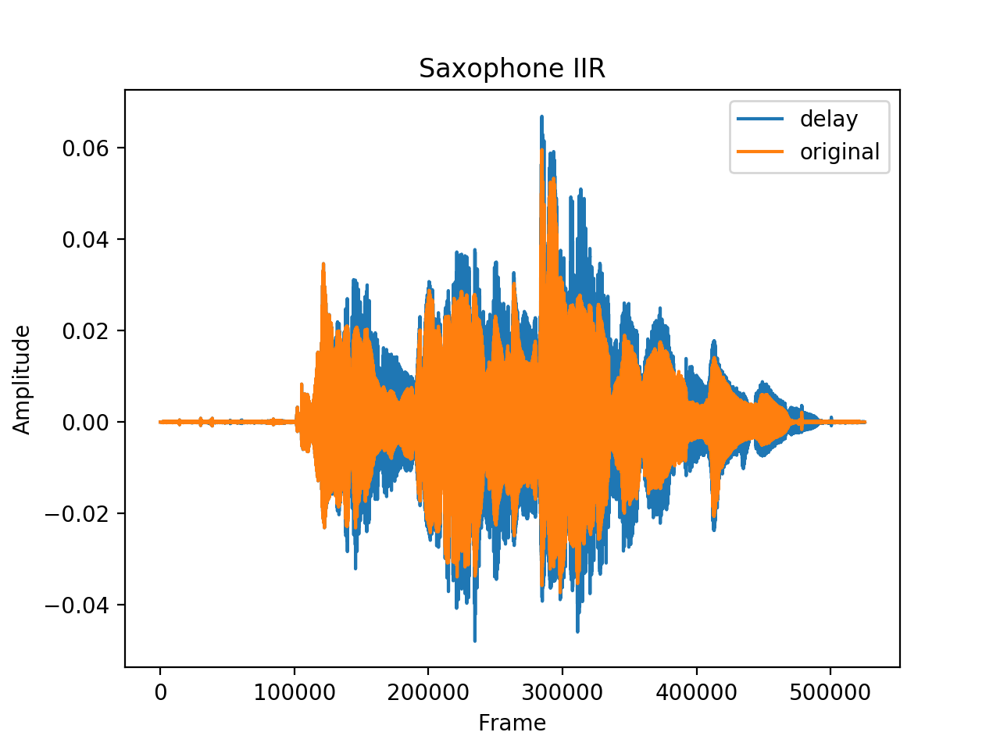
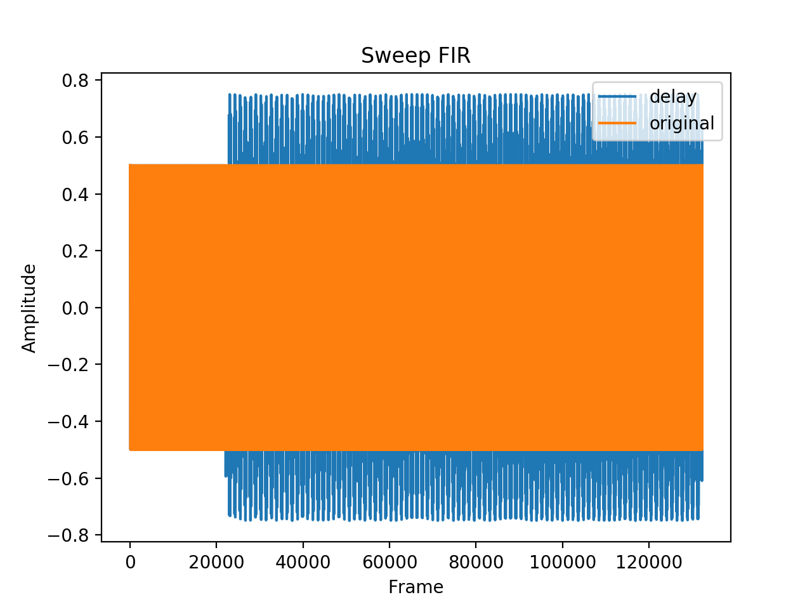
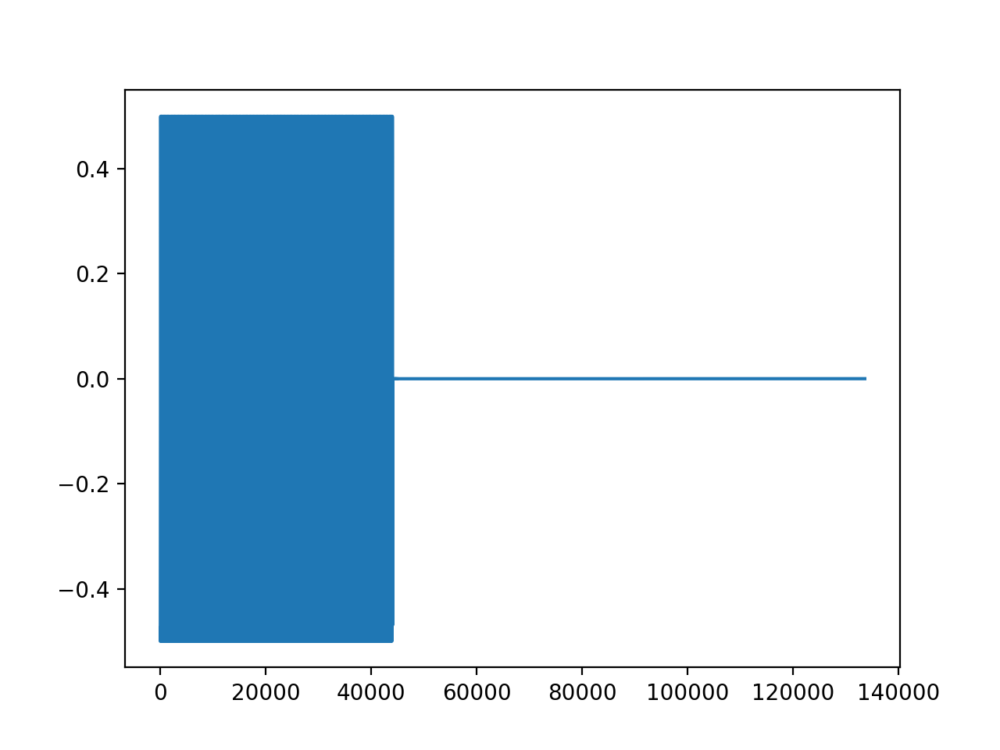
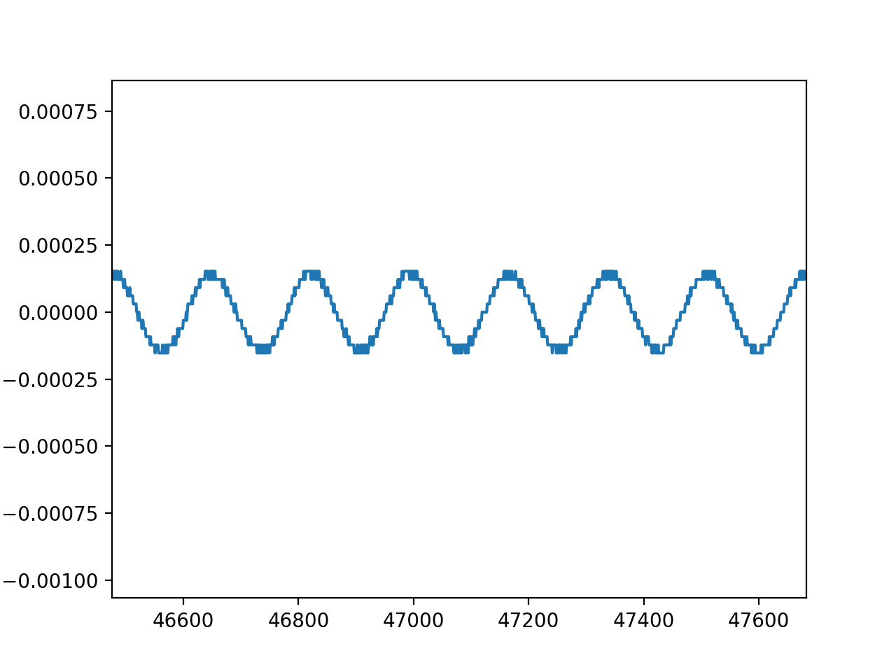
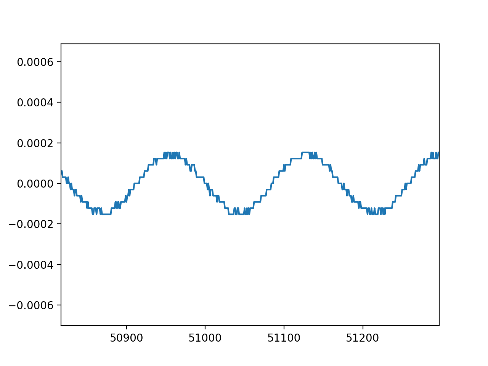

# Assignment 1

## Real-world Examples
Using both FIR and IIR Filter.

* Filter Gain: 0.5
* Delay Time: 0.5 s

### Saxophone

### Sweep

## Tests
Some tests here are not fully automated and require some manual checking. For
the testing, I moved all the main process into another function, which is called
by these testing functions.

### Test 1
For the test 1, I used a sine wave audio at 256 Hz and 1s delay time. The result
shows that the wave form is almost cancelled after the delay takes effect. The
non-zero result might be due to the floating-point calculation and the imperfect
testing file.

### Test 2
I copy the same setting as test 1 except the filter type. The result shows the
wave form is not perfectly cancelled, which is in the expectation.

### Test 3
All the output waveforms are the same.

### Test 4
The output audio has 0 amplitude.

### Test 5
This test tests the parameter setting and getting. (It helped find a bug.)
