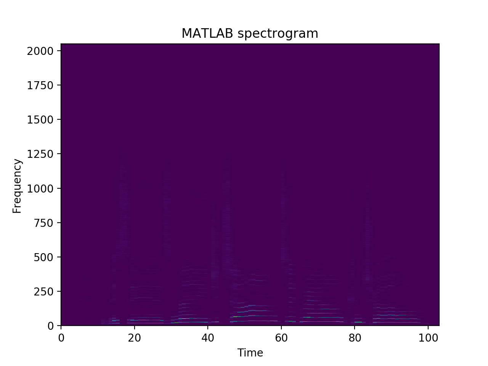

# Exercise 3

## Implementation

The format of the C++ output is transposed compared to the MATLAB output, since
it's easier to output line by line. The RMS calculation and data visualization
have been implemented in `python/fft_vis.py`, where the C++ output has been
transposed to match the MATLAB output.

## Comparison

- RMS: 0.0045

The f0 and harmonic bins in the C++ output is less prominent than the MATLAB
output. It's probably because the imaginary parts are abandoned in `doFft`.
